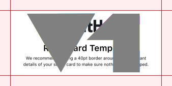

# FastAPI Template V1

Template project for FastAPI applications.

## Tests

Automated tests are implemented with pytest, and are organized in three levels:

- Unit tests: single functions; every external dependency is mocked;
- Integration tests: single endpoints; databases and external services are mocked;
- Acceptance tests: single or multiple endpoints; databases and external services are not mocked.

## Pipeline

CI/CD pipeline is implemented using Dagger.

### Examples of Dagger calls

- Run tests `dagger call test`
- Publish Docker image `dagger call publish-docker-image --token cmd://"op read op://employee/github/password"`
- Export OpenAPI schema `dagger call export-openapi-schema -o .`